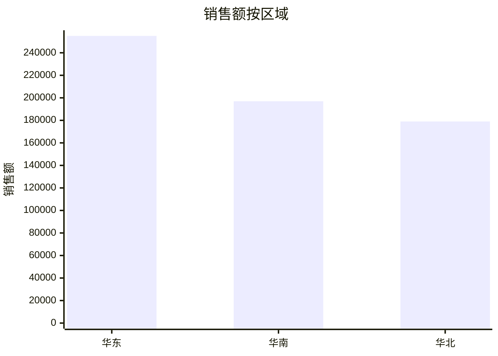

# 企业报表分析报告

## 问题

按区域统计销售额和利润，找出销售额最高的区域

## 结论

区域“华东”的销售额最高，为 255,000，同时利润 51,000。本次结果共包含 3 个分组。

## 字段与口径

- 数据源：C:\Users\admin\Documents\Codex\2026-08-14\craft-agent-agent-csv-excel-agent\examples\sales.csv
- Sheet：default
- 维度：区域
- 指标：销售额 (sum)、利润 (sum)

## 结果

| 区域 | 销售额 | 利润 | 记录数 |
| --- | --- | --- | --- |
| 华东 | 255,000 | 51,000 | 2 |
| 华南 | 197,000 | 39,000 | 2 |
| 华北 | 179,000 | 31,000 | 2 |

## 图表

## 假设与限制

- 业务字段依据 LLM Wiki 映射。
- 默认对指标使用求和；问题包含“平均/均值”时使用平均值。
