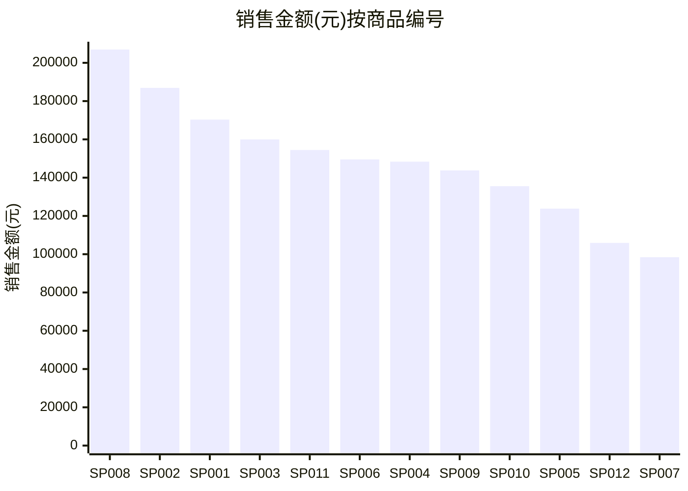

# 企业报表分析报告

## 问题

最高的金额是哪个

## 结论

商品编号“SP008”、商品名称“保湿面霜50g”的销售金额(元)最高，为 206,955。本次结果共包含 12 个分组。

## 字段与口径

- 数据源：C:\Users\admin\Documents\Codex\2026-08-14\craft-agent-agent-csv-excel-agent\runs\2026-08-14T07-33-37-234Z-bec57060\input\2026年8月电商商品销售金额统计表.xlsx
- Sheet：2026年8月销售明细
- 维度：商品编号、商品名称
- 指标：销售金额(元) (sum)

## 结果

| 商品编号 | 商品名称 | 销售金额(元) | 记录数 |
| --- | --- | --- | --- |
| SP008 | 保湿面霜50g | 206,955 | 1 |
| SP002 | 智能手表 | 186,888 | 1 |
| SP001 | 无线蓝牙耳机 | 170,344 | 1 |
| SP003 | 移动电源20000mAh | 159,960 | 1 |
| SP011 | 坚果大礼包 | 154,440 | 1 |
| SP006 | 保温杯500ml | 149,520 | 1 |
| SP004 | 手机快充充电器 | 148,350 | 1 |
| SP009 | 氨基酸洁面乳 | 143,780 | 1 |
| SP010 | 口红礼盒套装 | 135,548 | 1 |
| SP005 | 纯棉四件套 | 123,802 | 1 |
| SP012 | 精品挂耳咖啡 | 105,910 | 1 |
| SP007 | 香薰蜡烛礼盒 | 98,434 | 1 |

## 图表

## 假设与限制

- 业务字段依据 LLM Wiki 映射。
- 默认对指标使用求和；问题包含“平均/均值”时使用平均值。
